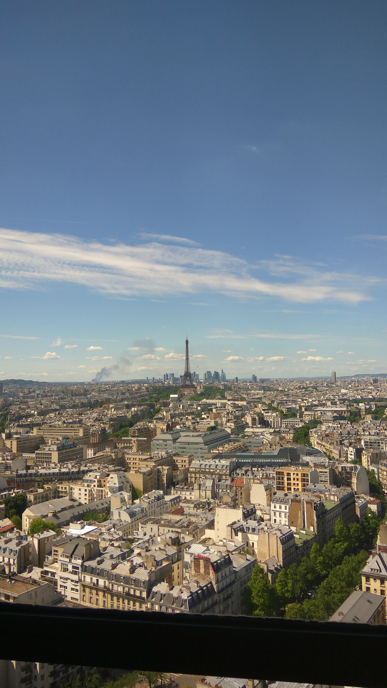
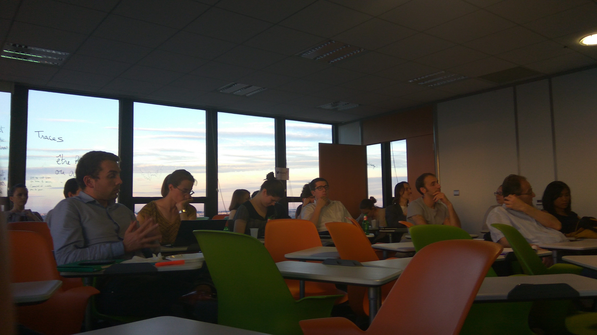
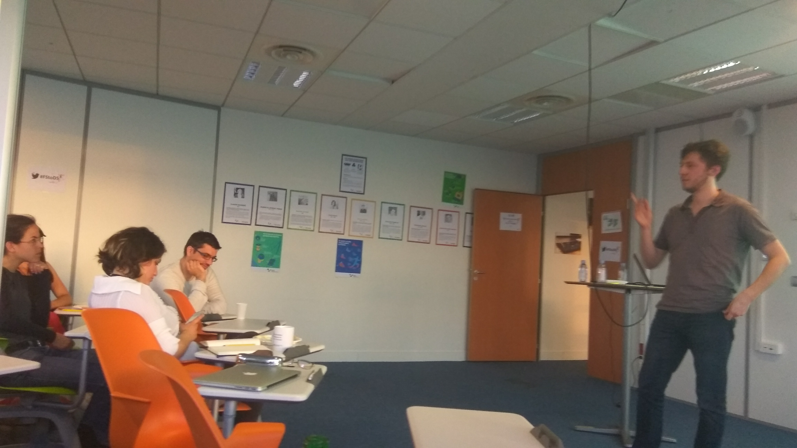
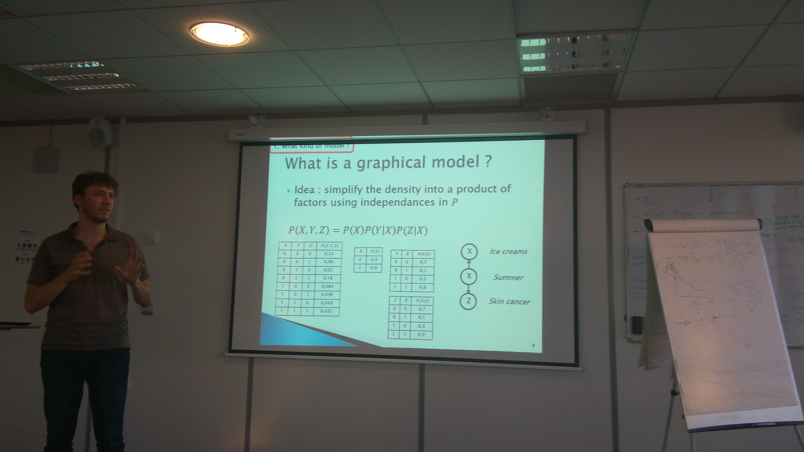
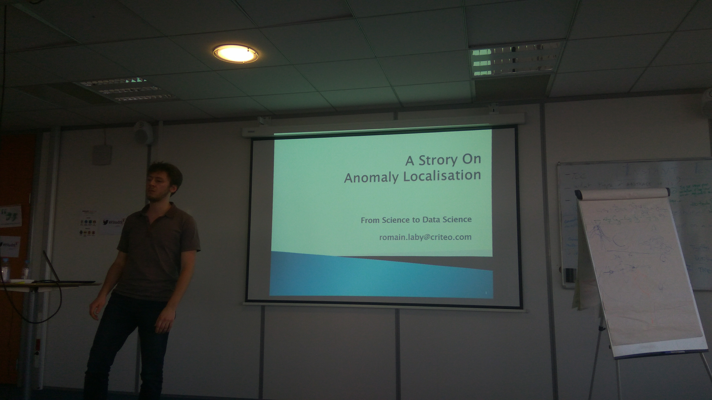
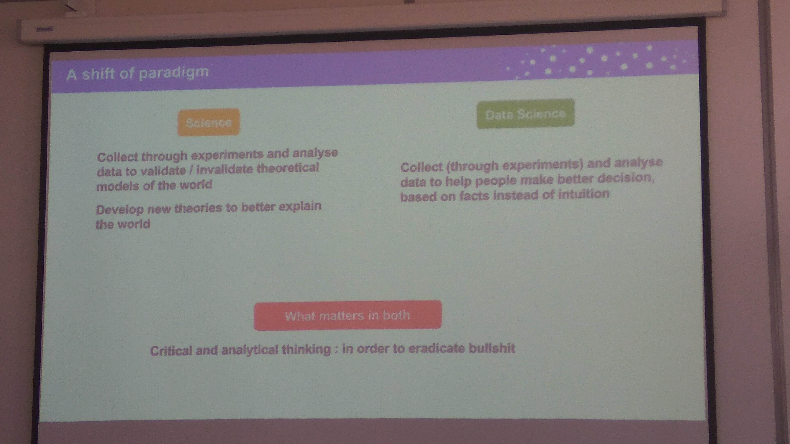
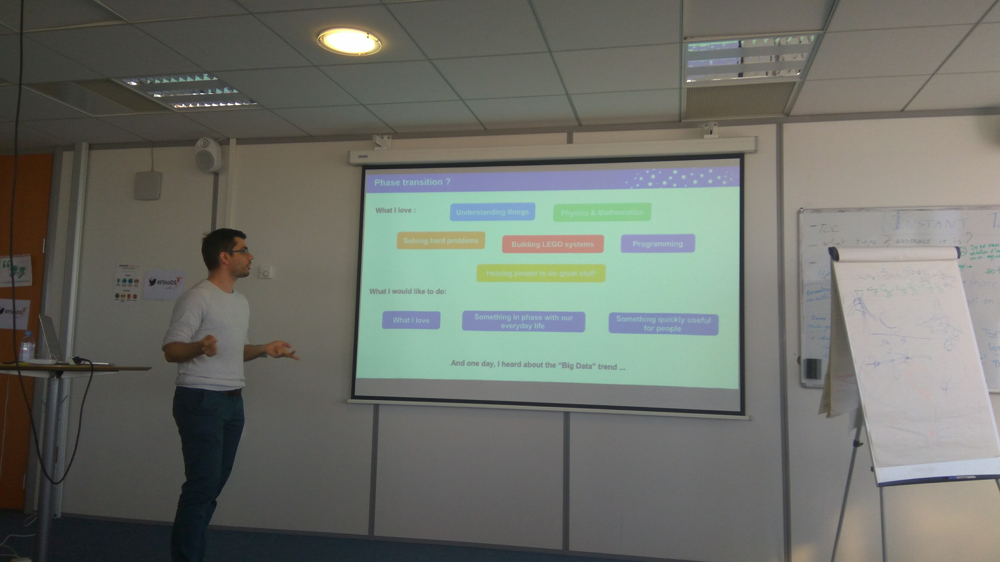
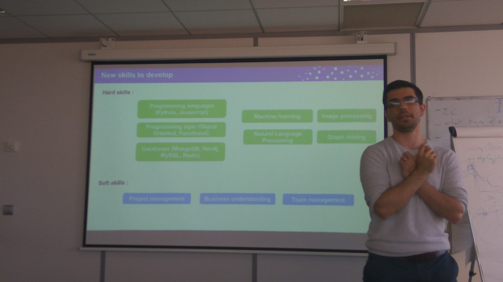

# From Science to Data Science #2
Tuesday, 16 May 2107  
CRI, Montparnasse tower  
seminar room 21.09 

See the [leaflet](./seminarV2.ai.pdf) and [leaflet](./seminarV3.ai.pdf)

Tickets available [here](https://events.cri-paris.org/event/24/attendees?sort_by=created_at&sort_order=desc&q=&page=1) 

 ## Intro

### Urszula Czerwinska
* [slides](./CRIDSclub2.pdf) 
* email: urszula.czerwinska@cri-paris.org
* website: http://urszulaczerwinska.github.io/
 

## Joseph Pellegrino
### From PhD in Quantum Physics to Chief Data Scientist, Kernix

 * [slides](./From_Science_to_Data Science.pdf) 

### Keywords
* PhD: 
  - science for passion
  - not happy with career prospects
  - soft skills 

* Transition
  - think what you like
  - self-education through onlince courses 
  - go to PhDTalent job fair 

* Kernix
  - data consulting
  - medium size data
  - diverse projects 
  - group work
  - building tools
  - short time work packages (3 months)
  - business understanding

### Links
  - http://callingbullshit.org/
  - https://www.phdtalent.org/

***I was looking for collective behavior induced by interactions between entities...***
 
 ### Contact
* LinkedIn: https://www.linkedin.com/in/joseph-pellegrino-a0092399/

## Gilles Wainrib
### From PhD in Mathematics applied to biology to CSO Owkin

* absent 

## Romain Laby
### From PhD at Thales to Software engineer at Criteo

 * [slides](./prez_seminaire_16mai17.pdf)  

### Keywords: 
* PhD
    - online anomaly localisation during plane flight
    - graphical models
    - model learning

* Criteo
    - very different challenges & technologies
    - big data
    - great working conditions

* Data Science in a company
    - 40% : understand the data 
    - 30% : communicate: Proof of concept, updates, plannings, ... 
    - 20% : research: The simplest works often fine !
    - Remaining 10% : useless meetings

### Contact
* email: romain.laby@criteo.com
* LinkedIn: https://www.linkedin.com/in/romain-laby-87917a46/

## Pictures

## Questions
If you have any question, please discuss on slack: https://cri-data-science-club.slack.com/ (with @cri-paris.org, @curie.fr or @pasteur.fr)

Otherwise send invitation request to: urszula.czerwinska@cri-paris.org
## License
https://creativecommons.org/licenses/by/4.0/

