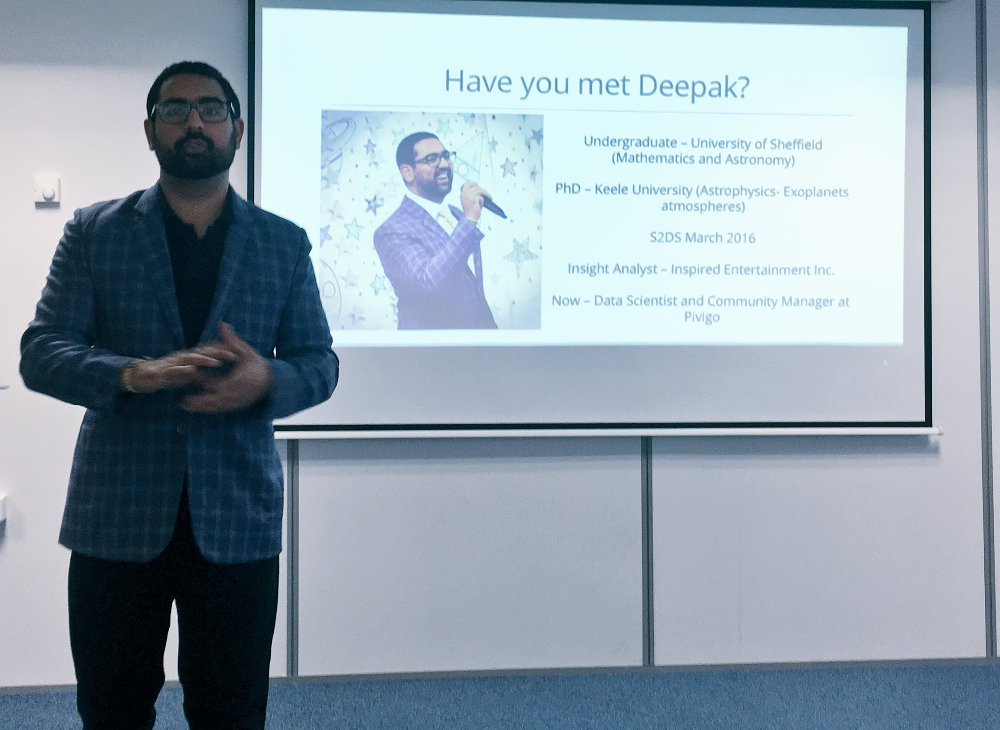
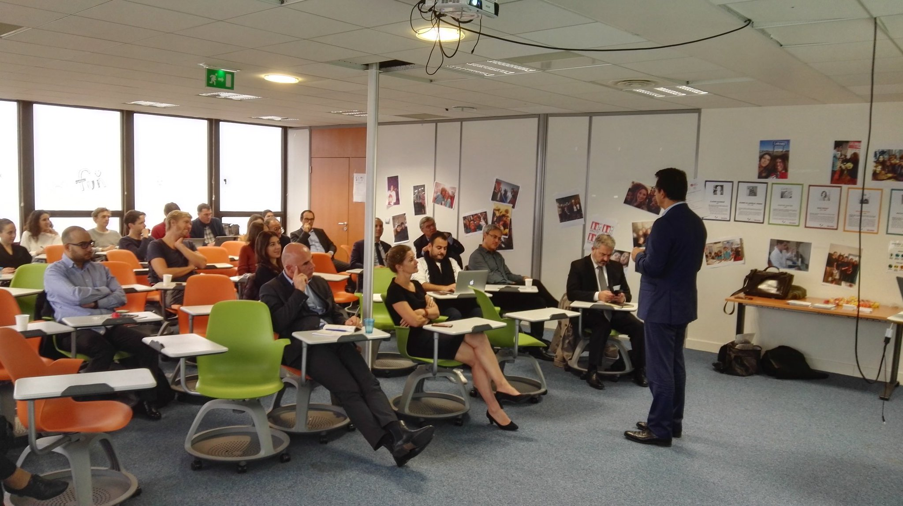
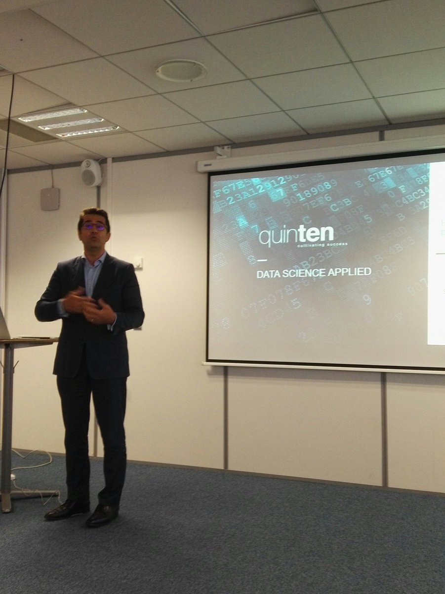
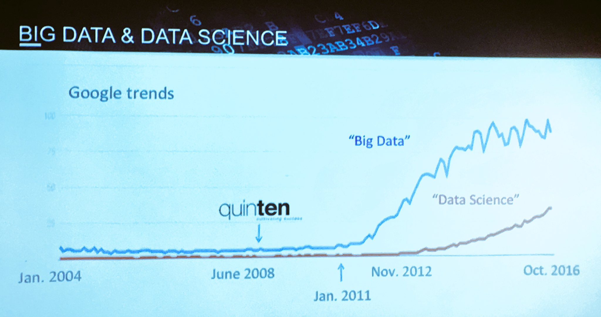
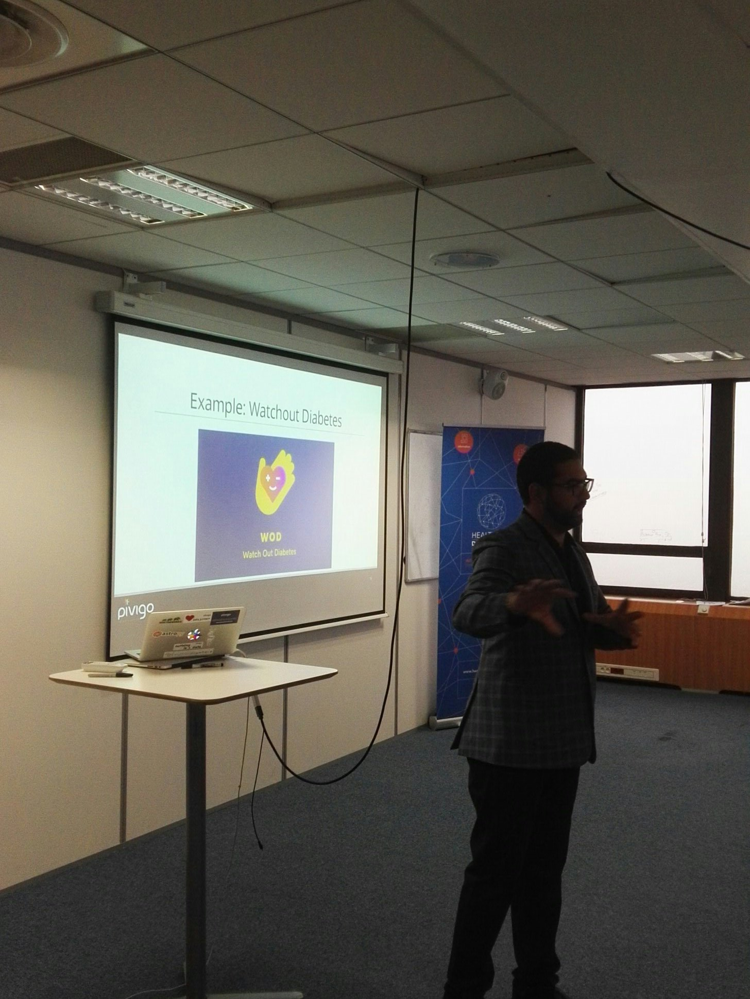

blockquote {
    max-width:390px;
    color: #5c4c40;
    text-align: center; 
    border-left: 3px solid #897860; 
    padding-left: 5px;
    margin:0 auto;
    background:red;
    width:auto;
    display:table
}

# From Science to Data Science #3 - Data jobs morning

Wednesday, 27 September 2107  
8AM - 10h30 AM  

See the [leaflet](./DSHDI.pdf)

Tickets available [here](https://events.cri-paris.org/e/96/from-science-to-data-science-3-data-jobs-morning) 

## Deepak Mahtani
### PhD in astrophysics, Data Scientist and community manager @ Pivigo & S2DS

* [slides](./Paris_2.pdf)  

### Keywords

* #### for PhDs

  * transition from PhD to Data Science is not that hard
  * PhD already have 90% of needed skills 
  * train yourself and build portfolio on [pivigo.com](https://www.pivigo.com/) and try *freelance*
  * gain business experience with  [**S2DS**](http://www.s2ds.org/) 5 week program on-site or on-line 

<blockquote class="twitter-tweet" data-lang="en">
Data Scientist (n.): Person who is better at statistics than any software engineer and better at software engineering than any statistician.
&mdash; Josh Wills (@josh_wills) <a href="https://twitter.com/josh_wills/status/198093512149958656?ref_src=twsrc%5Etfw">May 3, 2012</a></blockquote>

* #### for corporate

  *  [pivigo.com](https://www.pivigo.com/) can put you in contact with great data scientists 
  * it is not about **big** data but about **insightful** data
  * skills of data scientists are transferrable to different fields of expertise

### Links

  - http://www.s2ds.org/
  - https://www.pivigo.com/

### Contact
* LinkedIn: www.linkedin.com/in/mahtani89

* Twitter: [@deepakmahtani](https://twitter.com/deepakmahtani)

* e-mail: [deepak.mahtani@pivigo.com](mailto:deepak.mahtani@pivigo.com)

  ​

## Alexandre Templier
### Co-founder & chairman, QUINTEN Data Science Solutions

* [slides](./Quinten.pdf)  

### Keywords

* models in Data Science can be classified into 5 families and Quinten is a pioneer of *Symbolists* models
* data visualisation and user interface are crucial for clients
* Quinten consulted in a plethora of different projects 

### Links

  - http://www.quinten-france.com/

### Contact

* e-mail: [a.templier@quinten-france.com ](mailto:a.templier@quinten-france.com)

* twitter: [@QuintenFrance](https://twitter.com/quintenfrance?lang=en)

  ​

  ​

## Pictures

## Questions
If you have any question, please discuss on slack: https://cri-data-science-club.slack.com/ (with @cri-paris.org, @curie.fr or @pasteur.fr)

Otherwise send invitation request to: urszula.czerwinska@cri-paris.org
## License
https://creativecommons.org/licenses/by/4.0/

