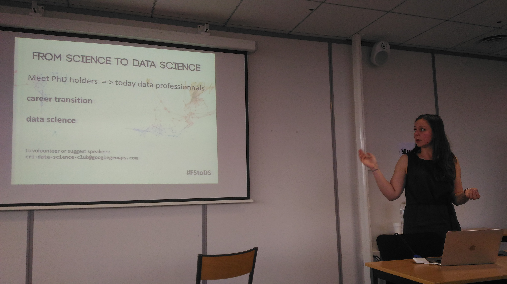
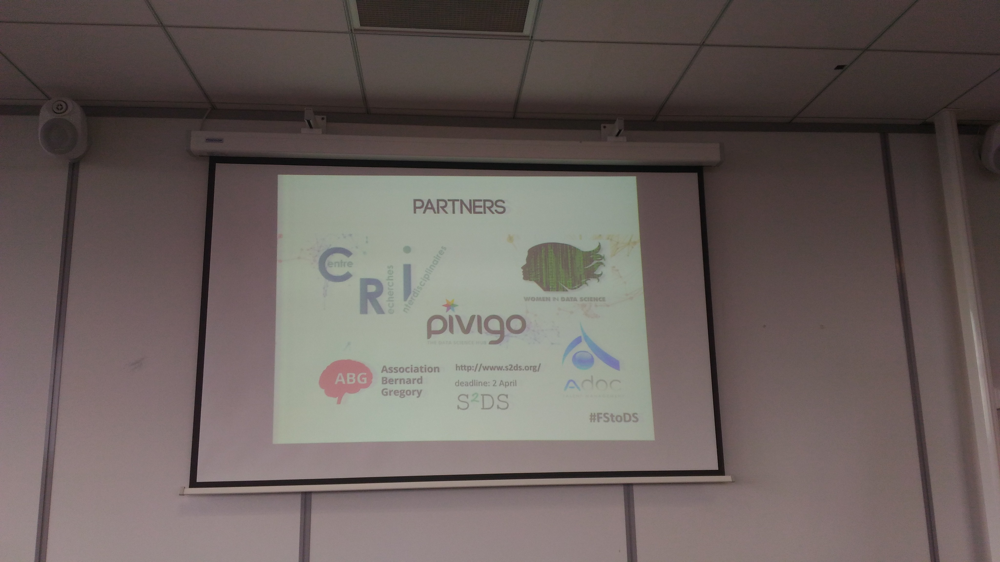

# From Science to Data Science seminars
The series of seminars aiming to fill the gap between young researchers and Data Science professionals. We invite PhD holding Data Science professionals to share their trainition from science to industry and tell us about thier work topics. Active exange between speakers is encouraged during the seminar and during less formal buffet. 

if you are interested to speak at our seminars send an email to: urszula.czerwinska@cri-paris.org

### our sponsors
* [**Centre des Recherches Interdisciplinaires**](https://cri-paris.org/) food, drinks, venu, stimulating enviornment
* [Pivigo Data Science Hub](https://www.pivigo.com/) mentoring, speakers 
* [Adoc Talent Managment](http://www.adoc-tm.com/) speakers
* [Association Berard Gregory](http://www.intelliagence.fr/) speakers 
* [Women in Data Science Paris](https://www.meetup.com/fr-FR/Women-in-Data-Science-WiDS-Paris/) speakers 

if you are interested to support us contact : urszula.czerwinska@cri-paris.org

## Data Science club
Data Science club at the CRI is a structure to create a network interested in Data Science, Machine Learning, Analytics and Big Data at the CRI and open for the students from the CRI and outside.
We propose a formula of self-paced club which would reduce the in-person meeting and provide online forum for exchange of knowledge for everyone. In addition to online group that would be sharing resources and exchange information. We organize workshops in little groups in order to learn i.e. a new skill, complete an online course and also bigger events with invited speakers – domain experts – from academia and industry.

----------

All materials from the seminars are available in this repository.

----------

List of events
<ul>
<li><a target="_blank" href="./1"> #1 31.03.2017</a></li>
<li><a target="_blank" href="./2"> #2 16.05.2017</a></li>
<li><a target="_blank" href="./3"> #3 27.09.2017</a></li>

</ul>

